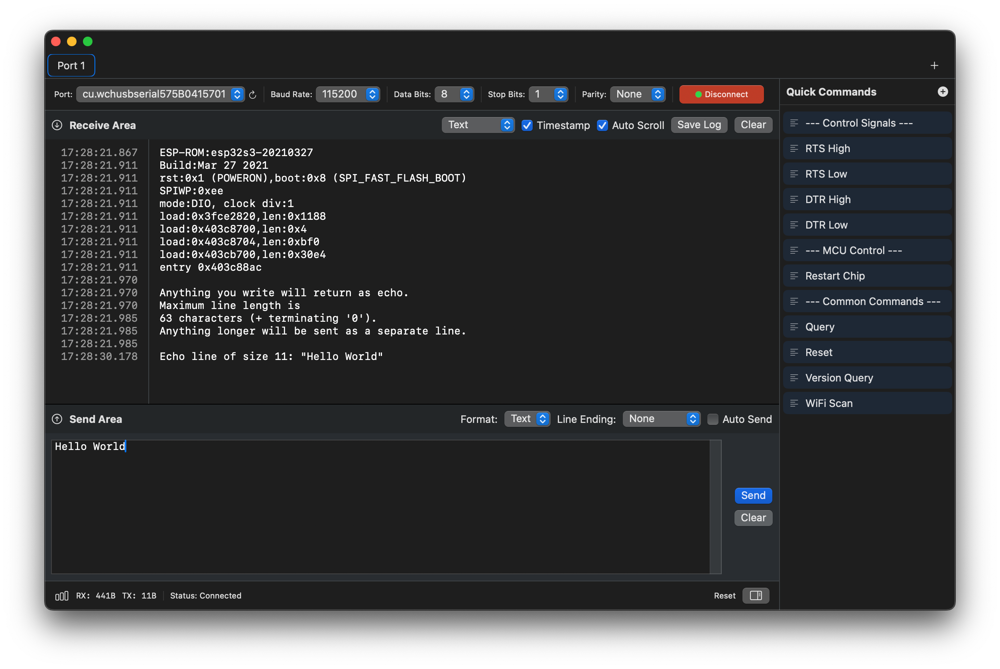

# MacSerial

[查看简体中文版说明](README_CHS.md)

  

A modern, feature-rich serial port communication tool for macOS, built with SwiftUI.

## Features

### 🚀 Core Functionality
- **Multi-tab Support**: Manage multiple serial port connections simultaneously with an intuitive tab interface
- **Real-time Communication**: Efficient serial port data transmission and reception
- **Multiple Display Formats**: View data in Text, HEX, or Mixed mode
- **Smart Data Management**: High-performance rendering with automatic data windowing for handling large data streams

### ⚙️ Flexible Configuration
- **Baud Rate**: Support for common rates (300 - 921600 bps) and custom values
- **Data Bits**: 5, 6, 7, or 8 bits
- **Stop Bits**: 1, 1.5, or 2 bits
- **Parity**: None, Odd, Even, Mark, or Space
- **Flow Control**: None, Hardware (RTS/CTS), or Software (XON/XOFF)
- **Signal Control**: Manual RTS/DTR signal control

### 📝 Quick Commands
- Create and manage custom quick-send commands
- Support for both text and HEX format commands
- One-click sending for frequently used commands

### 📊 Advanced Features
- **Timestamp Display**: Optional timestamp for each received data packet
- **Data Statistics**: Real-time RX/TX byte counters and error tracking
- **Auto-scroll**: Configurable auto-scroll behavior
- **Log Export**: Save communication logs to file (⌘S)
- **Data Filtering**: Clear receive/send buffers independently

### 🎨 User Interface
- **Native macOS Design**: Built with SwiftUI for a modern, native look and feel
- **Dark Mode Support**: Seamless integration with macOS system appearance
- **Keyboard Shortcuts**: Comprehensive keyboard shortcuts for efficient workflow
  - New Tab: ⌘T
  - Close Tab: ⌘W
  - Save Log: ⌘S
  - Clear Receive Buffer: ⌘K
  - Clear Send Buffer: ⌘⇧K
  - Clear All Buffers: ⌘⌥K

## System Requirements

- macOS 13.0 (Ventura) or later
- Xcode 15.0 or later (for building from source)

## Installation

1. Go to the [Releases page](https://github.com/Tomosawa/MacSerial/releases) and download the latest `.dmg` file.  
2. Open the downloaded `.dmg` file and drag the application into your **Applications** folder.  
3. Launch the app from your Applications folder.  

> **Note:** On first launch, macOS may block the app because it’s from an unidentified developer—a common security measure for third-party or open-source software not distributed through the App Store. If this happens, go to **System Settings > Privacy & Security**, scroll to the "Security" section, and click **"Open Anyway"** (or **"Allow Anyway"** on older macOS versions) to run the app.

## Usage

### Getting Started

1. **Select a Serial Port**: Choose your target device from the port dropdown menu
2. **Configure Settings**: Set the appropriate baud rate, data bits, stop bits, parity, and flow control
3. **Connect**: Click the "Connect" button to establish the connection
4. **Send Data**: Type your message in the send area and click "Send" or press Enter
5. **Receive Data**: Incoming data will be displayed in the receive area with optional timestamps

### Quick Commands

1. Click the "Quick Commands" button to open the quick command panel
2. Add new commands with custom names and content
3. Choose between Text or HEX format
4. Click on any command to send it instantly

### Multi-tab Management

- **New Tab**: Press ⌘T or use the File menu
- **Close Tab**: Press ⌘W or click the close button on the tab
- Each tab maintains its own independent serial port connection and settings

### Saving Logs

- Press ⌘S or use File → Save Log to export the receive buffer to a text file
- Logs include timestamps if the timestamp display is enabled

## Architecture

MacSerial is built with a clean, modular architecture:

- **SwiftUI**: Modern declarative UI framework
- **Combine**: Reactive programming for data flow
- **IOKit**: Low-level serial port communication
- **MVVM Pattern**: Separation of concerns with manager classes

### Key Components

- `SerialPortManager`: Handles serial port discovery, connection, and data transmission
- `TabManager`: Manages multiple serial port tabs
- `SerialTerminalView`: High-performance terminal display with NSTextView
- `QuickCommandPanel`: Quick command management and execution

## Localization

MacSerial supports multiple languages:
- English (en)
- Simplified Chinese (zh-Hans)

Localization files are located in the `en.lproj` and `zh-Hans.lproj` directories.

## Contributing

Contributions are welcome! Please feel free to submit a Pull Request. For major changes, please open an issue first to discuss what you would like to change.

1. Fork the repository
2. Create your feature branch (`git checkout -b feature/AmazingFeature`)
3. Commit your changes (`git commit -m 'Add some AmazingFeature'`)
4. Push to the branch (`git push origin feature/AmazingFeature`)
5. Open a Pull Request

## License

This project is licensed under the MIT License. See the [LICENSE](LICENSE) file for more details.

## Contact

If you have any questions or suggestions, please open an issue on GitHub.

---

Made with ❤️ for the macOS community
