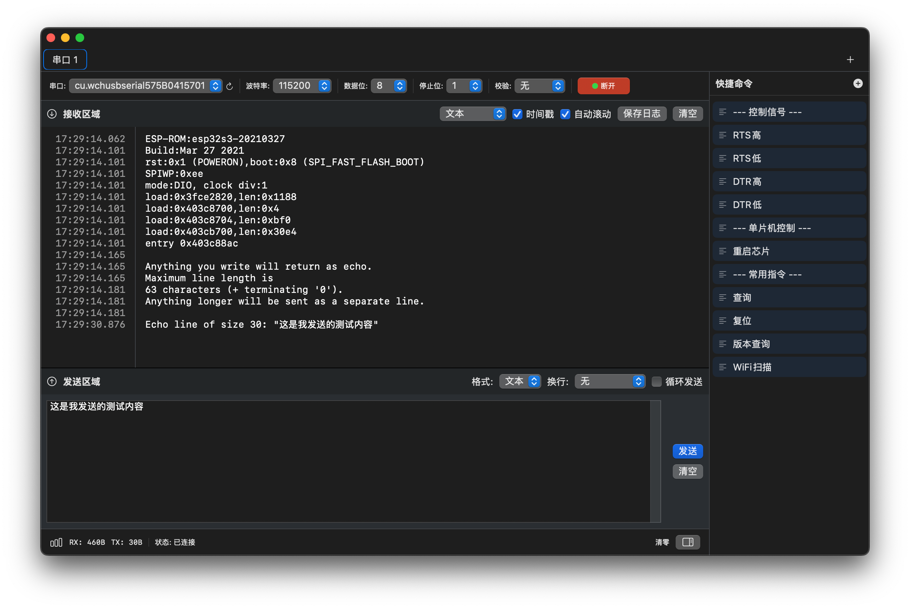

# MacSerial

[English](README.md)

  

一款为 macOS 打造的现代化、功能丰富的串口通信工具，使用 SwiftUI 构建。

## 功能特性

### 🚀 核心功能
- **多标签支持**：通过直观的标签界面同时管理多个串口连接
- **实时通信**：高效的串口数据发送和接收
- **多种显示格式**：支持文本、HEX 或混合模式查看数据
- **智能数据管理**：高性能渲染，自动数据窗口化处理大数据流

### ⚙️ 灵活配置
- **波特率**：支持常用速率（300 - 921600 bps）和自定义值
- **数据位**：5、6、7 或 8 位
- **停止位**：1、1.5 或 2 位
- **校验位**：无、奇校验、偶校验、标记或空格
- **流控制**：无、硬件流控（RTS/CTS）或软件流控（XON/XOFF）
- **信号控制**：手动 RTS/DTR 信号控制

### 📝 快捷命令
- 创建和管理自定义快速发送命令
- 支持文本和 HEX 格式命令
- 一键发送常用命令

### 📊 高级特性
- **时间戳显示**：为每个接收的数据包显示可选时间戳
- **数据统计**：实时 RX/TX 字节计数器和错误跟踪
- **自动滚动**：可配置的自动滚动行为
- **日志导出**：将通信日志保存到文件（⌘S）
- **数据过滤**：独立清除接收/发送缓冲区

### 🎨 用户界面
- **原生 macOS 设计**：使用 SwiftUI 构建，呈现现代化的原生外观
- **深色模式支持**：与 macOS 系统外观无缝集成
- **键盘快捷键**：全面的键盘快捷键，提高工作效率
  - 新建标签：⌘T
  - 关闭标签：⌘W
  - 保存日志：⌘S
  - 清空接收区：⌘K
  - 清空发送区：⌘⇧K
  - 清空所有缓冲区：⌘⌥K

## 系统要求

- macOS 13.0 (Ventura) 或更高版本
- Xcode 15.0 或更高版本（从源码构建时需要）

## 安装

1. 前往 [Releases 页面](https://github.com/Tomosawa/MacSerial/releases)，下载最新的 `.dmg` 安装文件。  
2. 双击下载好的 `.dmg` 文件，将应用拖拽到 **Applications（应用程序）** 文件夹中完成安装。  
3. 首次运行时，如果 macOS 弹出“无法验证开发者”或阻止运行的提示，这是系统对未经过 Apple 公证的第三方应用的正常安全机制。  
   此时请前往 **系统设置 > 隐私与安全性**，在“安全性”部分点击 **“仍要打开”** 或 **“允许运行”** 即可正常使用。

## 使用方法

### 快速入门

1. **选择串口**：从端口下拉菜单中选择目标设备
2. **配置设置**：设置适当的波特率、数据位、停止位、校验位和流控制
3. **连接**：点击"连接"按钮建立连接
4. **发送数据**：在发送区输入消息，然后点击"发送"或按回车键
5. **接收数据**：接收到的数据将显示在接收区，可选择显示时间戳

### 快捷命令

1. 点击"快捷命令"按钮打开快捷命令面板
2. 添加自定义名称和内容的新命令
3. 选择文本或 HEX 格式
4. 点击任意命令即可立即发送

### 多标签管理

- **新建标签**：按 ⌘T 或使用文件菜单
- **关闭标签**：按 ⌘W 或点击标签上的关闭按钮
- 每个标签都维护自己独立的串口连接和设置

### 保存日志

- 按 ⌘S 或使用"文件 → 保存日志"将接收缓冲区导出为文本文件
- 如果启用了时间戳显示，日志将包含时间戳

## 架构设计

MacSerial 采用简洁的模块化架构构建：

- **SwiftUI**：现代化的声明式 UI 框架
- **Combine**：响应式编程实现数据流
- **IOKit**：底层串口通信
- **MVVM 模式**：通过管理器类实现关注点分离

### 核心组件

- `SerialPortManager`：处理串口发现、连接和数据传输
- `TabManager`：管理多个串口标签
- `SerialTerminalView`：使用 NSTextView 实现的高性能终端显示
- `QuickCommandPanel`：快捷命令管理和执行

## 本地化

MacSerial 支持多种语言：
- 英语 (en)
- 简体中文 (zh-Hans)

本地化文件位于 `en.lproj` 和 `zh-Hans.lproj` 目录中。

## 贡献

欢迎贡献！请随时提交 Pull Request。对于重大更改，请先开启一个 issue 讨论您想要更改的内容。

1. Fork 本仓库
2. 创建您的特性分支（`git checkout -b feature/AmazingFeature`）
3. 提交您的更改（`git commit -m 'Add some AmazingFeature'`）
4. 推送到分支（`git push origin feature/AmazingFeature`）
5. 开启一个 Pull Request

## 开源协议

本项目使用 MIT 许可证。有关详细信息，请参阅 [LICENSE](LICENSE) 文件。

## 联系方式

如果您有任何问题或建议，请在 GitHub 上开启一个 issue。

---

为 macOS 社区倾情打造 ❤️
